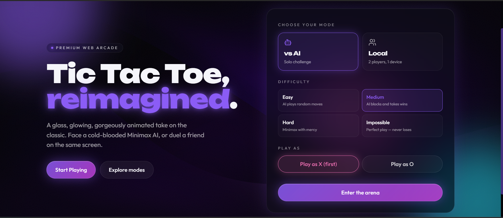
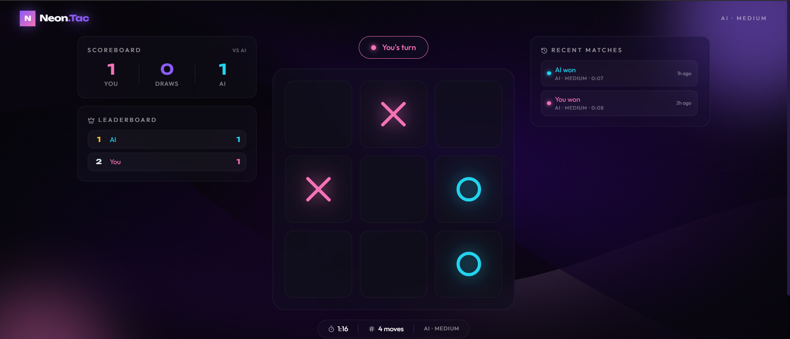

<div align="center">

# 🎮 Tic Tac Toe

Clean UI • Smart AI Opponent • Score Tracking • Fully Responsive

[](https://tic-tac-toe-two-ashen-45.vercel.app)
[](https://react.dev/)
[](https://tailwindcss.com/)
[](https://vercel.com/)

**[🚀 Live Demo](https://tic-tac-toe-two-ashen-45.vercel.app)** · **[🐛 Report Bug](https://github.com/yashrajagawane/tic-tac-toe/issues)** · **[✨ Request Feature](https://github.com/yashrajagawane/tic-tac-toe/issues)**

</div>

---

## 📸 Preview : 

<div align="center">



<br><br>



</div>

---

## 📖 About

Tic Tac Toe is a modern take on the classic game, rebuilt with React for a smooth and responsive experience. It supports both **Player vs Player** and **Player vs Computer** modes, with an AI opponent that plays strategically instead of randomly. The project is deployed live on Vercel and built with a clean, maintainable component structure.

---

## ✨ Features

### 🎮 Gameplay

🕹️ **Player vs Player Mode** — Classic two-player local gameplay
🤖 **Player vs Computer Mode** — Challenge an intelligent AI opponent
🔲 **Interactive 3x3 Board** — Smooth, responsive click interactions
⚡ **Real-Time Updates** — Instant board state changes
🏆 **Automatic Win Detection** — Detects all winning combinations instantly
🤝 **Draw Detection** — Recognizes when the game ends in a tie
🔁 **Restart Functionality** — Reset the board anytime with one click

### 🤖 AI Opponent

🧠 **Strategic Move Selection** — AI evaluates the board before acting
🛡️ **Blocks Winning Threats** — Prevents the player from winning when possible
🎯 **Seizes Winning Opportunities** — Takes winning moves when available
📊 **Positional Strategy Logic** — Prioritizes stronger board positions

### 🏆 Game Management

📈 **Score Tracking** — Keeps a running tally of wins and losses
📜 **Match History** — Review past game outcomes
🔄 **Turn Indicator** — Always know whose turn it is
🎉 **Winner Popup** — Clear end-of-game announcement
📌 **Live Game Status** — Real-time updates on game state

### ⚙️ Customization

🎛️ **Game Settings** — Configure gameplay to your liking
👤 **Player Preferences** — Personalize your experience
🔊 **Sound Controls** — Toggle sound effects on or off
📱 **Responsive Design** — Optimized for mobile, tablet, and desktop

### 💾 Data Persistence

🗄️ **Browser Storage** — Saves user preferences locally
🔄 **Session Continuity** — Retains game-related data between visits

---

## 🛠️ Tech Stack

⚛️ **React.js** — Core UI library for building the interface
📜 **JavaScript** — Game logic and AI implementation
🎨 **CSS** — Custom styling
💨 **Tailwind CSS** — Utility-first UI styling
⚙️ **CRACO** — Custom React app configuration
🪝 **React Hooks** — State and lifecycle management
🔧 **Git & GitHub** — Version control and repository hosting
▲ **Vercel** — Deployment and hosting

---

## 📂 Project Structure

```
tic-tac-toe/
│
├── frontend/
│   ├── public/
│   │
│   ├── src/
│   │   ├── components/
│   │   │   └── game/
│   │   │       ├── Board.jsx
│   │   │       ├── Controls.jsx
│   │   │       ├── Scoreboard.jsx
│   │   │       ├── WinPopup.jsx
│   │   │       └── ...other components
│   │   │
│   │   ├── hooks/
│   │   │   └── useGameState.js
│   │   │
│   │   ├── lib/
│   │   │   ├── gameLogic.js
│   │   │   └── ai.js
│   │   │
│   │   ├── pages/
│   │   ├── App.js
│   │   └── index.js
│   │
│   ├── package.json
│   └── package-lock.json
│
├── backend/
├── tests/
└── README.md
```

---

## 🚀 Getting Started

### Prerequisites

Make sure the following are installed on your system:

- [Node.js](https://nodejs.org/)
- npm
- [Git](https://git-scm.com/)

Verify installation:

```bash
node -v
npm -v
git --version
```

### 📥 Clone the Repository

```bash
git clone https://github.com/yashrajagawane/tic-tac-toe.git
cd tic-tac-toe
```

### 💻 Run Locally

```bash
cd frontend
npm install
npm start
```

The app will be available at:

```
http://localhost:3000
```

### 🏗️ Production Build

```bash
npm run build
```

Optimized static files will be generated in:

```
frontend/build
```

---

## 🎮 How to Play

1. Open the application
2. Select your preferred game mode (Player vs Player or Player vs Computer)
3. Choose your symbol — **X** or **O**
4. Click on any empty cell to make your move
5. Be the first to align three symbols in a row

**Winning combinations:**

- ↔️ Horizontal line
- ↕️ Vertical line
- ↗️ Diagonal line

Example winning board:

```
X | X | X
---------
O | O |  
---------
  |   |  
```

---

## 🧠 AI Logic

The AI opponent is built using pure JavaScript game logic, without any external ML libraries. It:

- Scans the board for immediate winning moves
- Blocks the player's winning attempts
- Prioritizes strategically strong positions (center and corners)

**Relevant files:**

| Purpose | File |
|---|---|
| AI decision-making | `frontend/src/lib/ai.js` |
| Core game rules | `frontend/src/lib/gameLogic.js` |

---

## 🌐 Deployment

This project is deployed on **Vercel**:

1. Connect the GitHub repository to Vercel
2. Set the frontend directory as the project root
3. Vercel installs dependencies automatically
4. Production build runs on deploy
5. App goes live instantly

**🔗 Live Website:** [tic-tac-toe-two-ashen-45.vercel.app](https://tic-tac-toe-two-ashen-45.vercel.app)

---

## 🧪 Testing

```bash
npm test
```

---

## 🔮 Roadmap

🌍 **Online Multiplayer** — Play against friends remotely
🔥 **WebSocket Support** — Real-time synced gameplay
👤 **User Authentication** — Personal accounts and profiles
🏆 **Global Leaderboard** — Compete with players worldwide
📱 **Mobile App** — Native mobile experience
🎨 **More Themes & Animations** — Expanded visual customization
☁️ **Cloud Score Storage** — Sync scores across devices

---

## 🤝 Contributing

Contributions are always welcome!

1. Fork this repository
2. Create a new branch:
```bash
   git checkout -b feature-name
```
3. Make your changes
4. Commit your changes:
```bash
   git commit -m "Added new feature"
```
5. Push to your branch:
```bash
   git push origin feature-name
```
6. Open a Pull Request

---

## 👨‍💻 Author

<div align="center">

### Yash Agawane

[](https://github.com/yashrajagawane)

</div>

---

## ⭐ Support

If you found this project useful or interesting, consider giving it a **star** on GitHub — it helps a lot!

<div align="center">

**Thank you for checking out this project...! 🎮**

</div>
